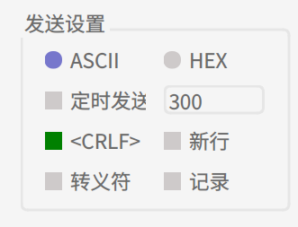
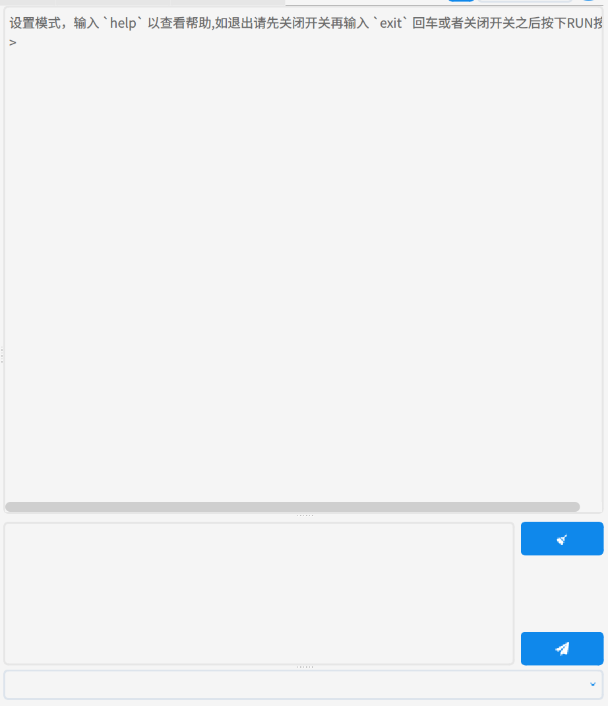

# 使用串口进行键位修改
## SerialStudio在win下无法读取串口,且在Linux下通讯输出会乱码,暂时未找到解决方案,可以使用Thonny的串口shell来代替
最近的固件更新中更新了基于串口的指令设置方式（目前只支持更改按键）

支持PC（Windows,Linux,OSX）端以及Android端

## 安装串口通信软件

如果你有其他的串口软件并且会使用,可以不用完全按照下文来做

### PC端

请根据自己的平台前往SerialStudio的[Release](https://github.com/Serial-Studio/Serial-Studio/releases)下载安装文件

- Windows用户请下载以`exe`或`Windows.zip`结尾的文件
- Linux用户请下载以`AppImage`结尾的文件
- OSX用户请下载以`macOS.zip`结尾的文件

### Android端

请前往F-droid或者Google Play下载`Serial USB Terminal`

你还需要一根OTG线

## 使用串口通信软件连接RKD

连接之前确保RKD的`F3`没有上拨,如果上拨了,请拨下之后按下`RUN`按钮

### ~~PC端 (SerialStuido)~~ SerialStudio在Windows以及Linux下存在较大问题,请直接跳到"使用Thonny的shell来修改"

使用调试线连接PC与RKD


连接之后打开`SerialStuido`


点击`COM端口`打开下拉栏

在此处选择端口
- Linux：选择`ttyACM*`
- OSX： 我不到啊
- Windows： 选择`COM*`
  - 如果你不知道哪个才是正确的端口,请先拔下调试线,注意看哪个端口消失了,然后再把调试线插回来，,选择多出来的那个端

其他参数无需变更

确保下图所示区域配置相同


然后点击绿色的`连接`



然后绿色的`连接`会变成红色的`断开`


此时将RKD的`F3`上拨

你将会在右边看见以下内容输出:



现在就成功连接到了RKD的设置串口

### Android端 (Serial USB Terminal)

使用OTG线+调试线连接RKD与Android设备

- 如果连接没有反应（RKD的电源指示灯`POW`未亮起）

  则有可能你的手机需要在设置中手动开启OTG功能，如何开启请根据自己的手机品牌型号自行百度

连接之后打开`Serial USB Terminal`


点击右上角的连接图标


此时应该会弹出一个授权窗口,点确定

然后拨上RKD的`F3`


如果出现以上内容则证明连接成功

## 进行键位修改

可以先输入`help`来查看可用的命令


目前只有`key`,用于获取键位设置和修改键位

可以输入`help <指令>` (不需要添加尖括号) 来查看对应指令的参数帮助

### 使用Thonny的shell来修改 (PC端)

先按照[thonnt_dev.md](thonny_dev.md)中的方法来配置thonny

然后使用调试线连接PC与RKD

打开`Thonny`,然后拨上RKD的`F3`,此时应该出现


进入设置模式成功

### 命令

可以通过`key getKeyList`来获取所有按键所对应的键名,`key getKeyMap`来获取键值

然后通过`key setKeyValue`来设置键的映射:
- 语法：`key setKeyValue <键名> <键值1> <键值2> ....`
  一次只能设置一个键名对应的键值,可以有多个键值(最多六个,可以实现组合键)
  修改的时候,注意RKD上`F1` `F2`的状态,这个两个开关决定了修改哪个预设组,用二进制的方式来设置预设组,上拨为1,下拨为0

  比如:
  ```
  F2  F1
  上  下
  ```
  对应的就是3号预设
  ```
  F2  F1
  下  下
  ```
  对应1号预设
  
  对命令`key getKeyGroupValue`以及`key getKeyValue`同样生效

  在非设置模式下也是通过这个方式来切换预设组

  当boot_mode为0时才有效,为1时不支持多预设切换(只有一号预设组),目前boot_mode写死在了主控代码中(普通用户不用理会)

`key getKeyGroupValue`和`key getKeyValue`:
- 用于获取整个当前预设组或者当前预设组特定键名对应按键键值
  `getKeyValue`需要指定键名,而`getKeyGroupValue`不需要(因为直接获取当前整个组)