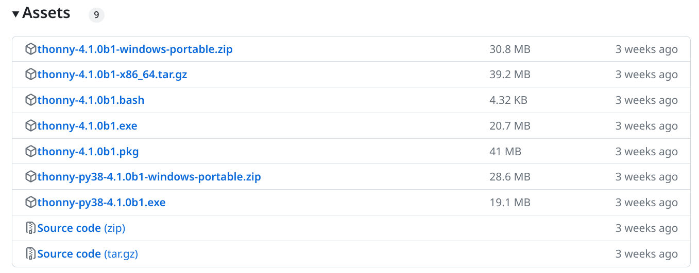
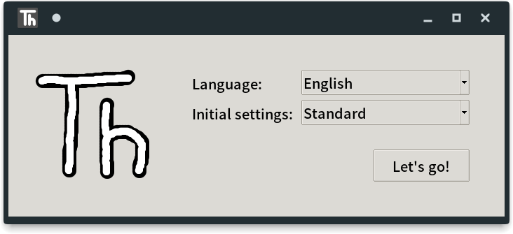
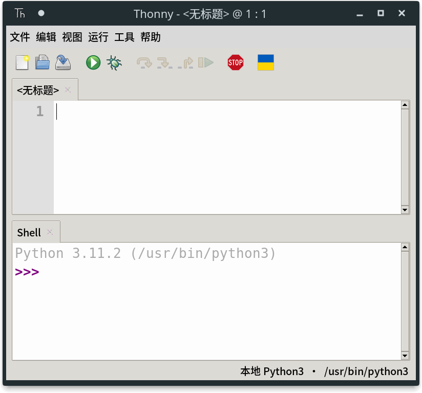
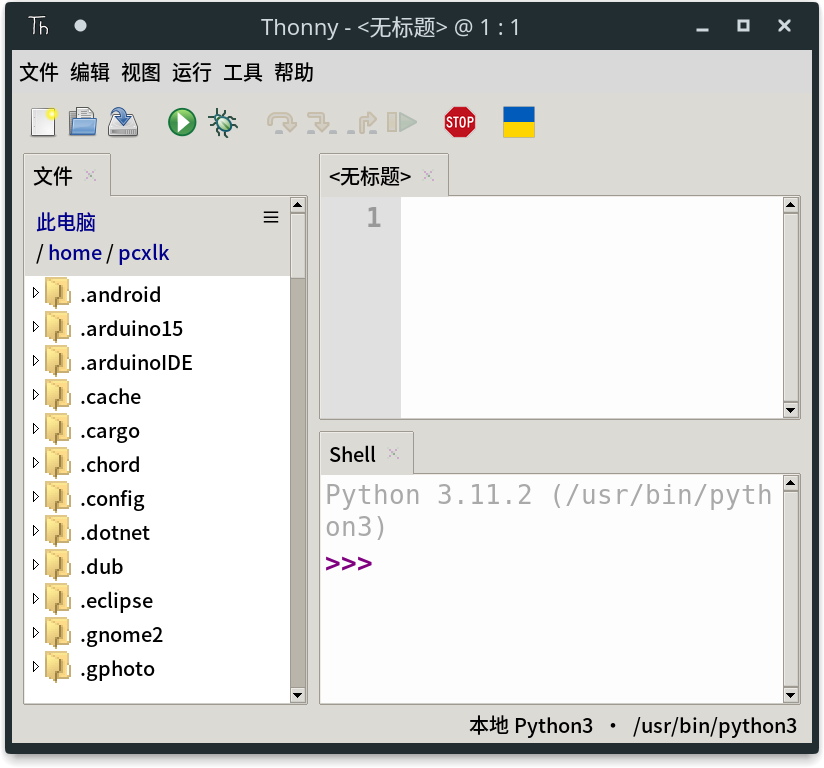
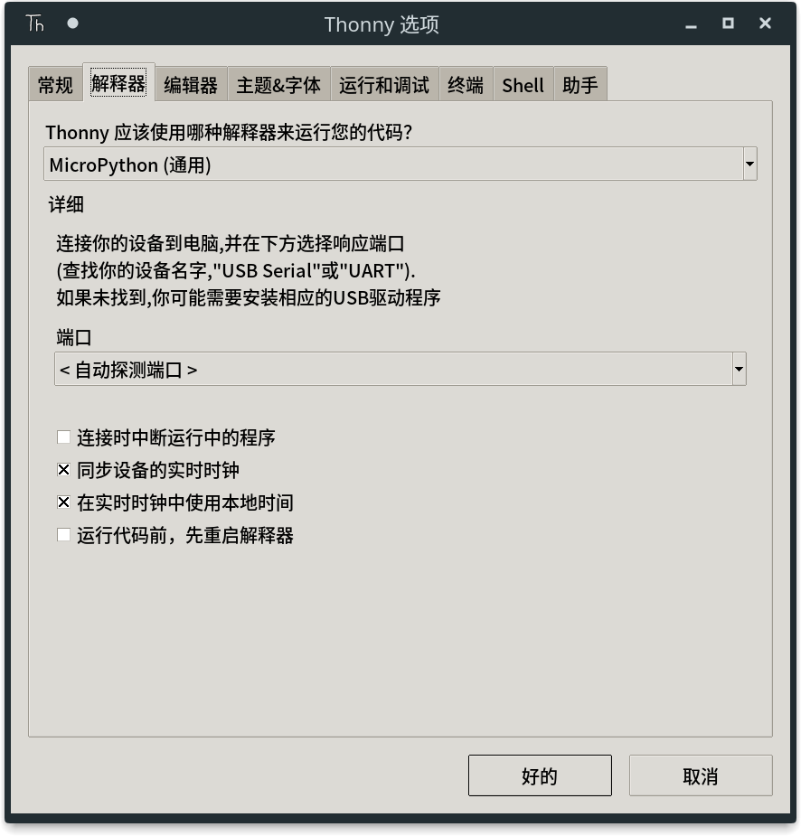

# 使用Thonny IDE进行键位设置/开发

## 已不再推荐使用该方法修改键位

## 1 - 安装Thonny

### 1.1 - Windows

如果你是Windows用户，请前往Thonny的[官网](https://thonny.org/)或者Github的[Release页面](https://github.com/thonny/thonny/releases)下载exe安装程序

#### 1.1.1 - 在官网或在Github Release下载安装程序

**在Thonny官网或者Github Release页面下载安装程序**

##### **Thonny[官网](https://thonny.org/)**


鼠标悬浮在"Windows"上，会弹出菜单

如果你的系统是Win7或者是32位，则应该选择
```
Installer with 32-bit Python 3.8
thonny-py38-x.x.x.exe
```

如果是Win7以上而且是64位的系统，则应该选择
```
Installer with 64-bit Python 3.10
thonny-x.x.x.exe
```

##### **Github [Release页面](https://github.com/thonny/thonny/releases)**



在展开Assets之后

如果你的系统是Win7或者是32位，则应该选择
```
thonny-py38-x.x.x.exe
```

如果是Win7以上而且是64位的系统，则应该选择
```
thonny-x.x.x.exe
```

#### 1.1.3 - 运行安装程序

下载完毕后运行下载的exe进行安装，进入下一步

安装完后请从桌面的Thonny快捷方式或者开始菜单启动Thonny，而不是再次启动安装exe！

### 1.2 - Linux

如果你是Debian系用户，执行以下命令即可安装（其他发行版用户请自行摸索安装方法）

```
sudo apt install thonny -y
```

如果软件源的Thonny比较老，则再执行以下指令更新（推荐pip换源后执行）
```
pip install --upgrade thonny --break-system-packages
```

### 1.3 - OSX

高贵的Mac用户请自行摸索安装方法（（

## 2 - 设置Thonny

### 2.1 - 初始设置

首次启动thonny会弹出这个窗口

在这里选择语言和初始配置



"Language"不用说，直接选择"简体中文"

"Initial settings"是初始配置，这里原封不动选择"Standard"，不要选择"Raspberry pi"，界面布局会变成依托答辩

然后点击"Let's go!"进入下一步

### 2.2 - 界面布局设置

不出意外的话，你的界面应该是这个样子



点击工具栏中的"视图"，中勾选"文件"

这时视图应该会变成这样



### 2.3 - 设置解释器

现在thonny的默认解释器还是系统中/自带的Pyhon环境，我们需要将其切换到"Micropython"解释器

点击工具栏中的"运行"，在点击"选择解释器"，会弹出Thonny的设置窗口

将"Thonny 应该使用哪种解释器来运行您的代码？"下拉框的内容更改为"Micropython (通用)"

取消勾选"连接时中断运行中的程序"和"运行代码前，先重启解释器"复选框

设置完后界面应该是这样



点击"好的"保存退出设置

## 3 - 使用Thonny进行键位更改/开发
<!--  -->
### 3.1 - 连接RKD & 将Thonny连接到RKD上的MPY REPL

首先使用调试线连接RKD到电脑上，系统把设备设置完毕后会在资源管理器中多出一个3mib容量的usb存储设备，不要使用资源管理器打开它

回到Thonny，先按下界面左上方的红色"停止/重启后端进程"按钮或者按下Ctrl+F2


如果界面底下shell面板输出如下（找无法自动找到设备）


请去设置解释器的页面中在端口下拉框中选择设备"Board in FS mode - Board CDC"


点击"好的"保存之后，shell面板应该输出如下，意思是设备忙于运行而无法响应


所以要在shell面板里面按下Ctrl+C终止RKD板上主控的运行，此时应该输出为下


然后你就会发现界面左边的"MicroPython设备"面板加载出了文件


这些文件储存在RKD主板上面的Flash中，"boot.py"文件和"lib"文件夹是RKD所运行的程序和依赖库

### 3.2 - 修改键位

只需要双击打开并修改"MicroPython设备"面板中的"config.json"就能修改键位


冒号前面为按键，冒号后面为该键对应的键值

只需要修改键值就能更改键位

按键名对应：
```
主板部分：
k1 从左往右数第一个键
k2 从左往右数第二个键
k3 从左往右数第三个键
k4 从左往右数第四个键

SDVX扩展板部分：
k5 底板的从左往右第一个键
k6 底板的从左往右第二个键
ST 底板中间的按钮
SR1L 左旋钮逆时针旋转
SR1R 左旋钮顺时针选择
SR2L 右旋钮逆时针旋转
SR2R 右旋钮顺时针旋转
```

这些按键都可以设置组合键，只需要按照json的格式在按键后的数组中追加即可

键值对应请查看[key_map.md](key_map.md)

修改完成按Ctrl+S保存

然后在shell面板中按下Ctrl+D即可恢复运行，之后就可以关掉Thonny了

### 3.3 - 开发

可以参考网络上的使用Thonny IDE开发Micropython的教程
